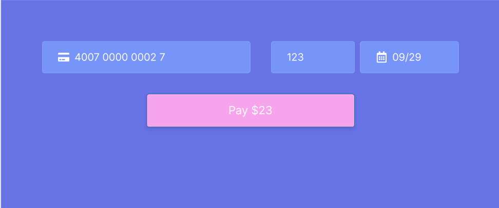

# React Authorize Net Example

This repo shows how to integrate React Authorize Net with NextJS/React.

## Getting started

1. Get a [Public Client Key](https://developer.authorize.net/api/reference/features/acceptjs.html#Generating_and_Using_the_Public_Client_Key)
   and a [API Login ID](https://support.authorize.net/knowledgebase/Knowledgearticle/?code=000001271) from Authorize.Net

2. Add them to a .env file located at root of your app

   ```env
   AUTHORIZENET_CLIENTKEY="REPLACE_WITH_CLIENT_KEY"
   AUTHORIZENET_LOGINID="REPLACE_WITH_LOGIN_ID"
   ```

3. Start the dev server

   ```bash
   yarn dev
   ```

4. Start the ssl proxy

   A SSL proxy is required to properly interact with Authorize.Net API

   ```bash
   yarn ssl-proxy
   ```

   This is optional but if you don't do it, you will get errors everytime you submit the form.

5. Launch the app

   The app show now be available on https://localhost:3001

## Example


